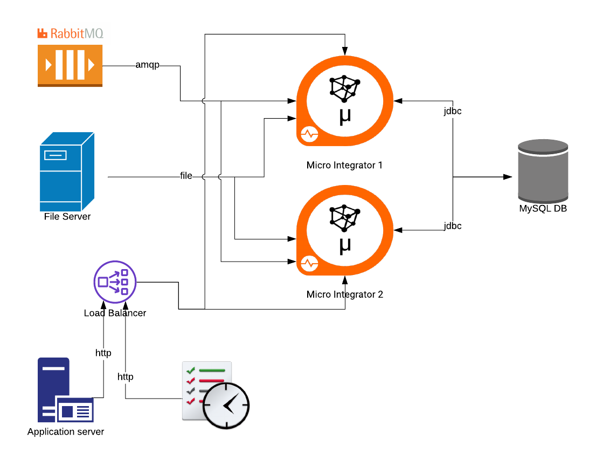

# DemoEICluster
## Description
The Demo aims to set up 2 instances of MI in light cluster and show how to this configuration can provide high availability for the main integration scenarios:
1. Service invocation
2. File Polling
3. Message Queue polling
4. DB polling

The description of the scenarios are depicted in this picture:


The use cases are those descibred and created in the demo/project: [(DemoEI_File_RabbitMQ_DB)](https://github.com/stefanonegri/DemoEI_File_RabbitMQ_DB)
## Prerequistes
This demo utilized Nginx as load balancer; Download Nginx 
## Pre Tasks
### Run the 2 instances of MI
1. Create 2 instances of MI
2. Deploy the assets developed in the *DemoEI_File_RabbitMQ_DB* using the attached car deployment file: [(EmployeeCompositeApplication_1.0.0.car)](EmployeeCompositeApplication_1.0.0.car)
3. Run the MI instances with the following commands:
- MI 1:
```
export NotifierEmployeesEP=http://localhost:8290/services/EmployeeDS/NotifierEmployee
export GetEmployeeAddressEP=http://localhost:8290/services/EmployeeDS/Employee
sh micro-integrator.sh -DenableManagementApi
```
- MI 2:
```
export NotifierEmployeesEP=http://localhost:8295/services/EmployeeDS/NotifierEmployee
export GetEmployeeAddressEP=http://localhost:8295/services/EmployeeDS/Employee
sh micro-integrator.sh -DenableManagementApi -DportOffset=15
```
### Configure Nginx
- Create the file [(ei.http.conf)](ei.http.conf) and copy it in the nginx conf directory.
- run nginx

